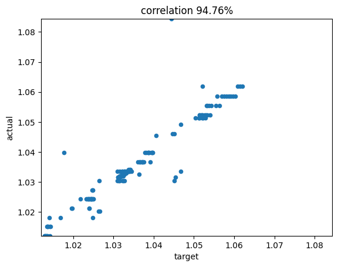
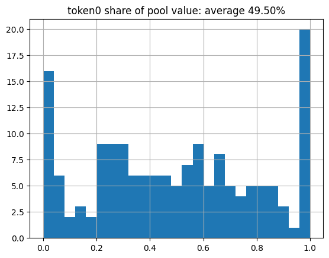
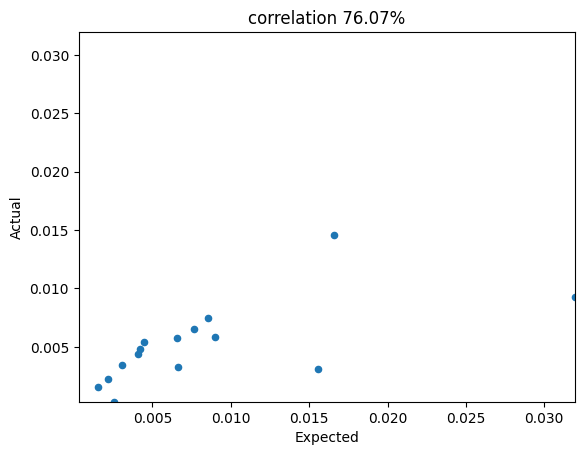
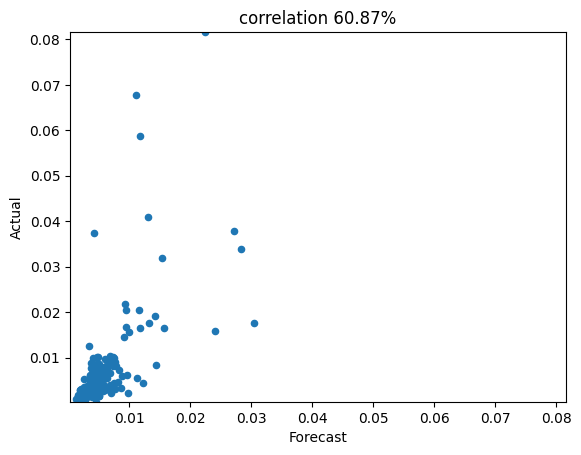
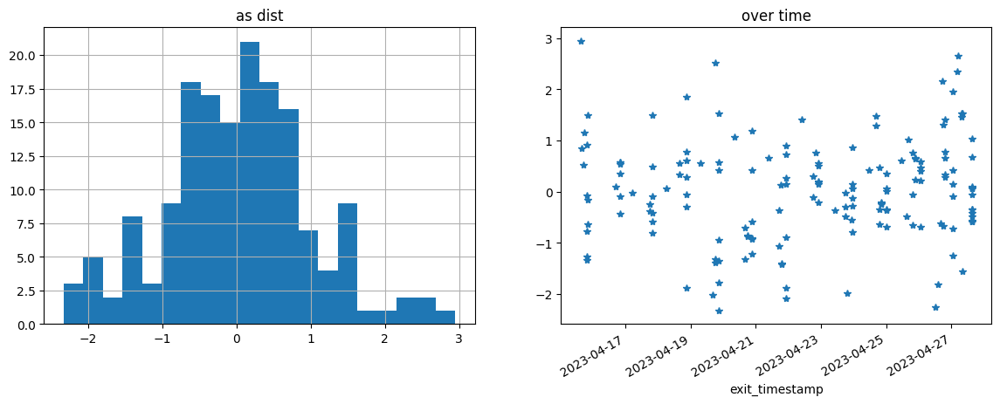
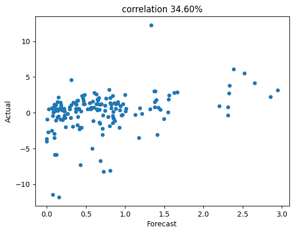
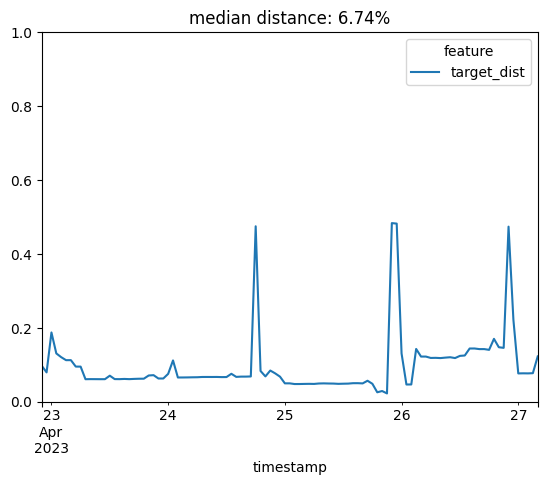
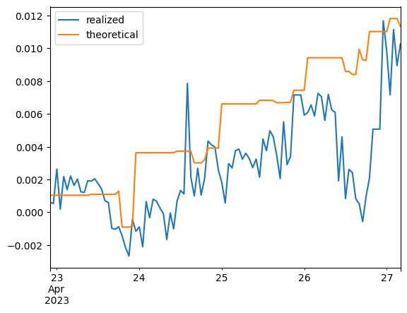

## Concentrated liquidity strategy deep dive
 
We currently run 16 market neutral active concentrated liquidty pools accross four blockchains. There are many moving parts - from return forecasting, to portfolio construction, to execution. Let's step through several and verify things are working as expected.

Target vs actual level of liquidity concentration:  Check that the level of concentration (range factor) for each liquidity position allign closely with the model's proposed level of concentration.  
 
Below we see that the target and actual range factors are nearly identical - 95% correlated.

    

    

Time in range: Check that liquidity positions average time in range (ie the share of time that we are collecting fees) lines up with expectations.   
 
Target time in range is curently 90%. Below we see the realized time in range is nearly the same at 91%.

    0.8991533463128222

Pool composition at exit: Check that both tokens are equal value on average when exiting positions. Given current model tuning this isn't required but it is expected if we're LPing well.   
 
Expected token 0 value share is 50%. Observed is also 50%.

    Text(0.5, 1.0, 'token0 share of pool value: average 49.50%')

    

    

Are we losing fees to MEV and Just In Time liquidity? Compare the actual fee return for each LP token to what was expected in our model. If expected fee returns align with actual then we don't see evidence of JIT impact.  
 
This is a partly manual process but so far no evidence. Correlation is pretty tight.  

    

    

Fee collection forecast skill: Do our forecast fee returns align with actual?  
 
Forecasted fee collection is highly correlated with actual. 

    

    

Volatility modeling: Have the token pair returns (ie exchange rate) we've observed in each of our LP positions looked as expected? If not it may indicate our models are not properly tuned.  
 
Token pair returns scaled by pair vol look normally distributed, as expected. Pair returns aren't too clustered or correlated over time.

    <AxesSubplot: title={'center': 'over time'}, xlabel='exit_timestamp'>

    

    

Net return forecast skill: How well can we forecast the net return of an LP token. The net return includes fee collection, impermanent loss, and rebalance transaction costs. Net returns are noisier than fee returns but should still be positive.   
 
Forecast net returns have been ~30% correlated with actual returns, higher than what is expected from the backtest. This suggests that we can have skill sizing our bets and have more room to improve performance over our current roughly equal weight construction.

    

    

LP net return volatility   
 
Current construction expects LP token return volatilty to be 7.5-10% annualized. Returns so far have been more volatile.

    0.14462205467797676

Trade execution: Aggregate distance from target holdings
   
In an ideal world we'd maintain exactly zero distance from target holdings. In practice some slippage is acceptable if it results in fewer transactions without giving up much in performance. Typical distance has been 6.5%; a level that is within expectations given current engine tuning. Distance did trend higher during the 26th which was a particularly turbulant day in the market.

    <AxesSubplot: title={'center': 'median distance: 6.74%'}, xlabel='timestamp'>

    

    

Trade exeuction - Realized vs theoretical returns. Compare model performance to a frictionless setting where all desired trades are exeucted with no slippage and all positions are perfectly hedged.   
   
Realized returns align very closely with frictionless theoretical returns though they are more volatile and tend to fall behind (as you'd expect becauase of slippage and imperfect execution). Some volatility in realized returns, including the largest directional moves, are due to USDC price fluctuations which can mostly be thought of as noise.

    <AxesSubplot: >

    

    

